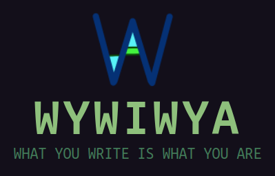

# WYWIWYA

WHAT YOU WRITE IS WHAT YOU ARE.

## Development

- Clone the repo: `git clone https://github.com/smallkirby/wywiwya.git`
- Install desp: `npm run ci && npm -w functions run ci`
- Start workspace: `npm run nirugiri`

Check [SECURITY](./memo/SECURITY.md), [ARCHITECTURE](./memo/ARCHITECTURE.md), [DEVELOPMENT](./memo/DEVELOPMENT.md), and [CREDENTIALS](./memo/CREDENTIALS.md) for more detail.
